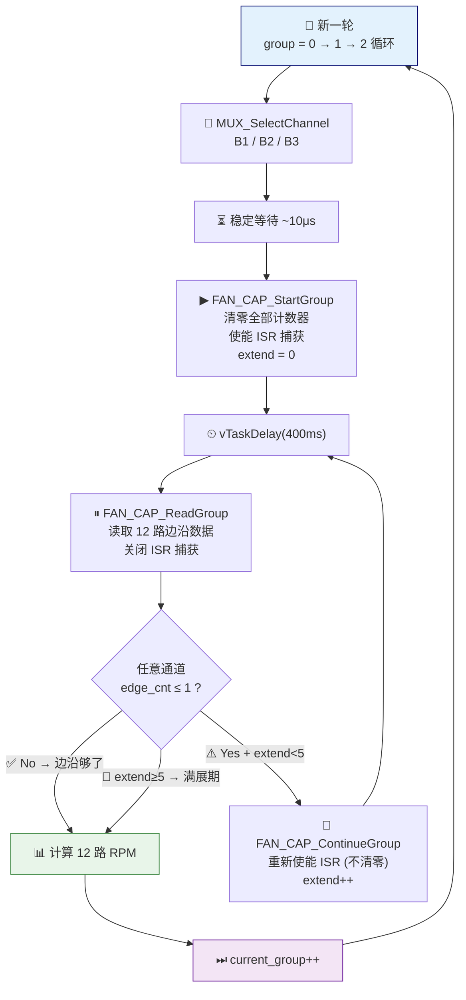
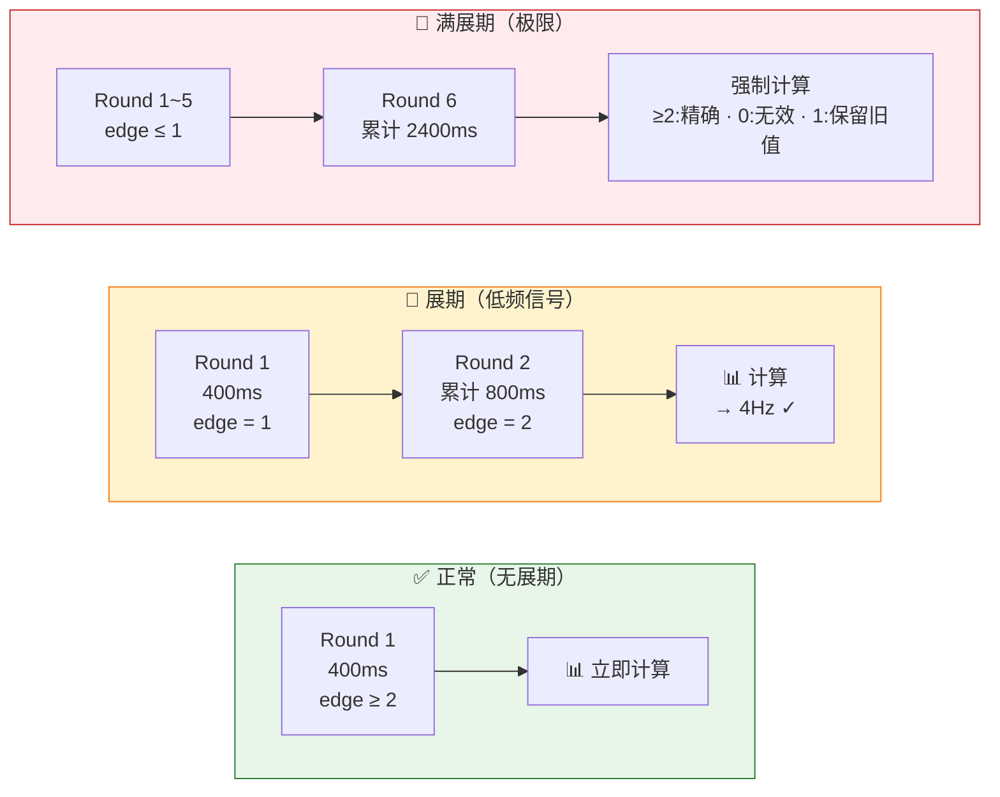
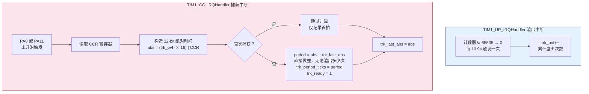

# 🔩 RTMSignalCollectionBox 测量原理说明

> STM32F103ZET6 · 全TIM硬件捕获 · V4.0  
> 风扇: 36路 (T16214 MUX + TIM2/4/8) | 轨道: 2路 (3Q3305 + TIM1)  
> **精度: 风扇 ±0.01% · 轨道 ±0.002%~1.7%**

---

## 一、风扇转速测量（36 路）

### 1.1 硬件拓扑

```
                          T16214 12刀3掷MUX
   ┌─────────────────────────────────────────────────────┐
   │                                                     │
   │   B1 (风扇  1~12) ──┐                               │
   │   B2 (风扇 13~24) ──┼── 内部切换 ──▶ 12路A端输出      │
   │   B3 (风扇 25~36) ──┘                               │
   │                                                     │
   │   选择引脚:  S0=PB5  S1=PE14  S2=PE15               │
   │   真值表:    000→B1  001→B2  010→B3  111→高阻        │
   └─────────────────────────────────────────────────────┘
                          │
          ┌───────────────┼───────────────┐
          ▼               ▼               ▼
    TIM2_CH1~4       TIM4_CH1~4      TIM8_CH1~4
    PA0 PA1 PA2 PA3  PB6 PB7 PB8 PB9 PC6 PC7 PC8 PC9
    通道 [0~3]       通道 [4~7]      通道 [8~11]

    每组 4ch × 3定时器 = 12通道 ──▶ MUX分时覆盖36路
```

| 定时器 | 总线 | PSC | 捕获频率 | 分辨率 | 引脚 |
|:------:|:----:|:---:|:--------:|:------:|:-----|
| **TIM2** | APB1 | 7199 | 10 kHz | 0.1 ms | PA0 · PA1 · PA2 · PA3 |
| **TIM4** | APB1 | 7199 | 10 kHz | 0.1 ms | PB6 · PB7 · PB8 · PB9 |
| **TIM8** | APB2 | 7199 | 10 kHz | 0.1 ms | PC6 · PC7 · PC8 · PC9 |

> ℹ️ 72MHz ÷ (7199+1) = 10,000 Hz。ARR=65535 → 溢出 6.55s，对风扇绰绰有余。

---

### 1.2 ISR 设计（极简）

ISR **只累加边沿**，不计算 RPM——计算留给 FAN_Task：

| ISR 动作 | 变量 | 触发时机 |
|:---------|:-----|:---------|
| 边沿计数 +1 | `fan_edge_cnt[ch]++` | 每次上升沿 |
| 记录首边沿时间 | `fan_first_tick[ch] = CCR` | 仅首次 |
| 记录末边沿时间 | `fan_last_tick[ch] = CCR` | 每次更新 |

```c
// 核心：每个捕获通道的 ISR 逻辑
if (TIM 捕获到上升沿) {
    ccr = 读取 CCR 值;
    if (!采集使能标志) return;     // ← 未使能直接跳过
    if (首次边沿) 记录首时间;
    边沿计数++;
    记录末时间;
}
```

> ✅ **设计要点**: `fan_group_running` 标志控制 ISR 使能——`StartGroup` 置 1，`ReadGroup` 置 0，避免竞态。

---

### 1.3 主循环流程



| 步骤 | 函数 | 作用 |
|:----:|:-----|:-----|
| 1 | `MUX_SelectChannel` | 切换 MUX 到当前组 |
| 2 | `FAN_CAP_StartGroup` | 清零计数器, 使能 ISR |
| 3 | `vTaskDelay(400ms)` | 采集窗口 |
| 4 | `FAN_CAP_ReadGroup` | 读数, 关闭 ISR |
| 5 | 检查边沿 → 展期 or 计算 | 自适应决策 |
| 6 | `FAN_CAP_ContinueGroup` | 展期: 重新使能(不清零) |

---

### 1.4 RPM 计算公式

```
📐 采集窗口: 400ms × (extend + 1),  最大 2400ms
⏱  捕获时钟: 10kHz  →  1 tick = 0.1ms

───────────────────────────────────────────
  dt_ticks   = last_tick − first_tick         （首末边沿时间差）

  freq_x100  = (edge_cnt − 1) × 1,000,000     （频率 ×100, 0.01Hz 精度）
               ─────────────────────────
                      dt_ticks

  RPM = freq_x100 × 60 ÷ (100 × PPR)          （转/分钟, 不截断小数）
  Hz  = freq_x100 ÷ 10                         （显示值 Hz×10）
───────────────────────────────────────────
```

| 频率 | 窗宽 | 边沿数 | dt≈ | 验证 |
|:------:|:------:|:------:|:------:|:-------|
| **100 Hz** | 400 ms | 40 | 3900 | (39×1e6)÷3900 = **10000** → 100.00 Hz |
| **40 Hz** | 400 ms | 16 | 3750 | (15×1e6)÷3750 = **4000** → 40.00 Hz |
| **4 Hz** | 800 ms | 3 | 5000 | (2×1e6)÷5000 = **400** → 4.00 Hz |
| **1 Hz** | 2400 ms | 2 | 10000 | (1×1e6)÷10000 = **100** → 1.00 Hz |

---

### 1.5 自动展期机制



| 轮次 | 累计时间 | 触发条件 | 动作 |
|:----:|:--------:|:---------|:-----|
| **R1** | 400 ms | edge ≥ 2 ? | ✅ 计算换组 · ⚠️ 否→展期 |
| **R2** | 800 ms | edge ≥ 2 ? | ✅ 计算换组 · ⚠️ 否→展期 |
| **R3** | 1200 ms | edge ≥ 2 ? | ✅ 计算换组 · ⚠️ 否→展期 |
| **R4** | 1600 ms | edge ≥ 2 ? | ✅ 计算换组 · ⚠️ 否→展期 |
| **R5** | 2000 ms | edge ≥ 2 ? | ✅ 计算换组 · ⚠️ 否→展期 |
| **R6** | 2400 ms | 🛑 强制计算 | ≥2=精确 · 0=无效 · 1=保留上轮 |

| 覆盖频率 | 所需轮次 | 总耗时 |
|:---------:|:-------:|:-----:|
| ≥10 Hz | R1 | 400 ms |
| 4~10 Hz | R1~R2 | 400~800 ms |
| 2~4 Hz | R2~R3 | 800~1200 ms |
| 1~2 Hz | R3~R6 | 1200~2400 ms |
| <1 Hz | R6 | 2400 ms（满） |

> ⚠️ **已知限制**: 展期以组为单位共享决策。若同组既有 100Hz 又有 1Hz 信号，高速通道也会被迫等待。改进方向: 每通道独立展期。

---

## 二、轨道转速测量（2 路）

### 2.1 硬件拓扑

```
                    3Q3305 双通道 MUX (B1 常通)
   ┌────────────────────────────────────────────────┐
   │                                                │
   │  轨道 FG1 ──▶ B1 ──▶ A ──▶ PA8  (TIM1_CH1)    │
   │  轨道 FG2 ──▶ B1 ──▶ A ──▶ PA11 (TIM1_CH4)    │
   │                                                │
   │  控制: PE10~PE13  (OE=0, S=0 → B1 常通)       │
   │  无分时切换 — 两路同时连续捕获                  │
   └────────────────────────────────────────────────┘
```

| 定时器 | 总线 | PSC | 捕获频率 | 分辨率 | 溢出周期 | 引脚 |
|:------:|:----:|:---:|:--------:|:------:|:-------:|:-----|
| **TIM1** | APB2 | 12000 | 6 kHz | 166.7 μs | 10.9 s | PA8 · PA11 |

> ℹ️ 72MHz ÷ (12000+1) ≈ 6,000 Hz。TIM1_UP_IRQ 累计溢出 → 32-bit 绝对坐标 → 理论无低频上限。

---

### 2.2 双 ISR 架构



> 🔑 **核心优势**: `abs = (trk_ovf << 16) | CCR` 构造了单调递增的 32-bit 绝对时间戳，`period = abs_new - abs_old` 直接相减，无需关心中间溢出多少次。

---

### 2.3 绝对时间坐标原理

```
┌─────────────────────────────────────────────────────────────┐
│  传统方法（单溢出检测）:                                      │
│    CCR 值（0~65535）→ 两次做差                               │
│    new < old → 溢出 1 次 → period = new + 65536 − old       │
│    ❌ 只能处理 1 次溢出（≤10.9s），多次溢出无法检测            │
├─────────────────────────────────────────────────────────────┤
│  改进方法（多溢出跟踪）:                                      │
│    trk_ovf = 累计溢出次数                                    │
│    abs = (trk_ovf << 16) | CCR    ← 32-bit 单调递增          │
│    period = abs_new − abs_old     ← 直接减，无限溢出          │
│    ✅ 32-bit trk_ovf 可追踪 ~8 天，完全覆盖任意低频           │
└─────────────────────────────────────────────────────────────┘
```

| 频率 | 溢出次数 | 绝对跨度 | 验证 |
|:-----:|:-------:|:-------:|:-----|
| **2 Hz** | 0 | 3,000 | 3000 − 0 = **3000** |
| **0.1 Hz** | 5 | 60,000 | 60000 − 0 = **60000** |
| **0.01 Hz** | 54 | 600,000 | 600000 − 0 = **600000** |
| **0.001 Hz** | 549 | 6,000,000 | 自动补偿 ✓ |

---

### 2.4 RPM 计算公式

```
⏱  捕获时钟: 6kHz  →  1 tick = 166.7 μs
📐 溢出周期: 10.9s

───────────────────────────────────────────
  ticks = trk_period_ticks              （相邻上升沿之间的计数值）

  RPM = 360,000 ÷ (ticks × PPR)         （= 60×6000 ÷ ticks ÷ PPR）
  Hz  = 60,000 ÷ ticks                  （Hz ×10 显示值）
───────────────────────────────────────────
```

| 频率 | ticks | 计算 | 量化误差 |
|:-----:|:-----:|:-----:|:--------:|
| **100 Hz** | 60 | 60000÷60 = 100.0 Hz | ±1.67% |
| **10 Hz** | 600 | 60000÷600 = 10.0 Hz | ±0.17% |
| **2 Hz** | 3,000 | 60000÷3000 = 2.0 Hz | ±0.03% |
| **0.1 Hz** | 60,000 | 60000÷60000 = 0.1 Hz | ±0.002% |
| **0.01 Hz** | 600,000 | 60000÷600000 = 0.01 Hz* | ±0.0002% |

> \* 超低频 hz 计算需用 `uint32_t` 宽运算: `(60000000UL / ticks)` 避免溢出。

---

## 三、测量精度总结

### 3.1 风扇精度

| 频率 | 精度 | 更新速度 | 说明 |
|:-----:|:----:|:-------:|:-----|
| **>10 Hz** | ±0.03% | 400 ms/组 | 一窗口多边沿, 不展期 |
| **4~10 Hz** | ±0.03% | 400~800 ms | 偶尔展 1 轮 |
| **2~4 Hz** | ±0.01% | 800~1200 ms | 展 1~2 轮 |
| **1~2 Hz** | ±0.01% | 1200~2400 ms | 展 2~5 轮 |
| **0.5~1 Hz** | ±0.01% | 2400 ms | 展满, 精度高 |

### 3.2 轨道精度

| 频率 | 精度 | 说明 |
|:-----:|:----:|:-----|
| **>10 Hz** | ±0.17~1.7% | 高频分辨率偏粗 |
| **1~10 Hz** | ±0.03~0.17% | — |
| **0.1~1 Hz** | ±0.002~0.03% | 低频极高精度 |
| **<0.1 Hz** | <±0.002% | 多溢出跟踪, 理论无上限 |

### 3.3 误差来源分析

| 来源 | 量级 | 说明 |
|:-----|:----:|:-----|
| **晶振精度** | ±20 ppm | 0.002% — 可忽略 |
| **量化误差** | ±1 tick / (N−1) | 边沿越多越准 |
| **整数截断** | ✅ 已修复 | RPM 用 `freq_x100` 直算, 不经过 `freq_hz` |
| **硬件串扰** | 邻脚耦合 | 未用 TIM 脚需外接 10kΩ 下拉 |

---

## 四、资源占用

| 资源 | 芯片容量 | 项目占用 | 余量 |
|:-----|:-------:|:-------:|:----:|
| **Flash** | 512 KB | ~29.8 KB | 🟢 94% 剩余 |
| **SRAM** | 64 KB | ~39.2 KB | 🟢 ~24 KB 剩余 |
| **定时器** | 8 个 | TIM1/2/4/8 (4个) | 🟡 TIM3/5/6/7 空闲 |
| **GPIO** | 112 脚 | 71 脚 | 🟢 41 脚空闲 |

> ✅ **结论**: 资源充裕。Flash 剩余 94%，SRAM 剩余 ~24KB，4 个定时器备用。系统可稳定运行。
